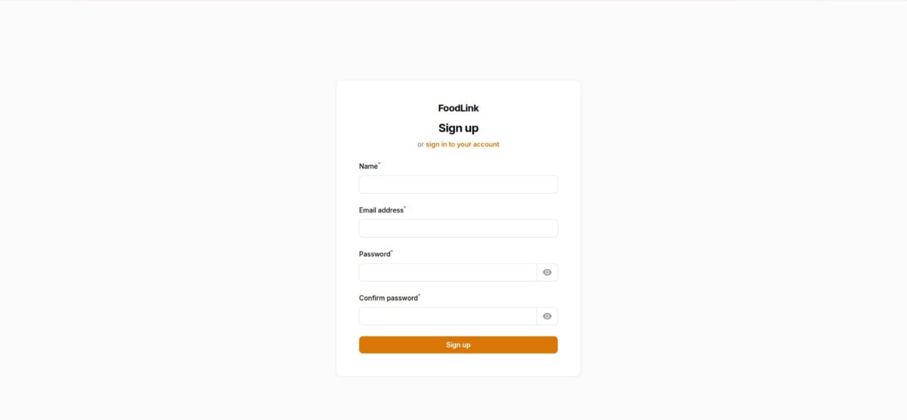
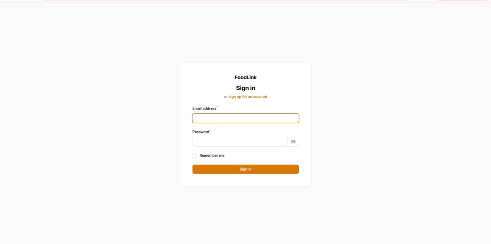
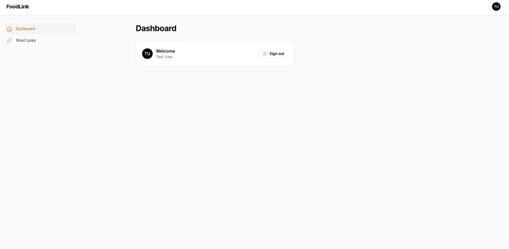
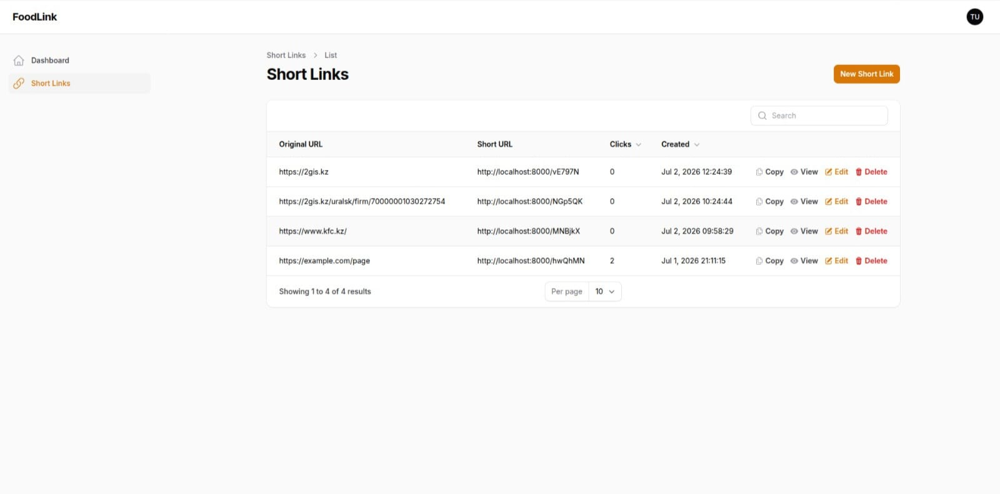
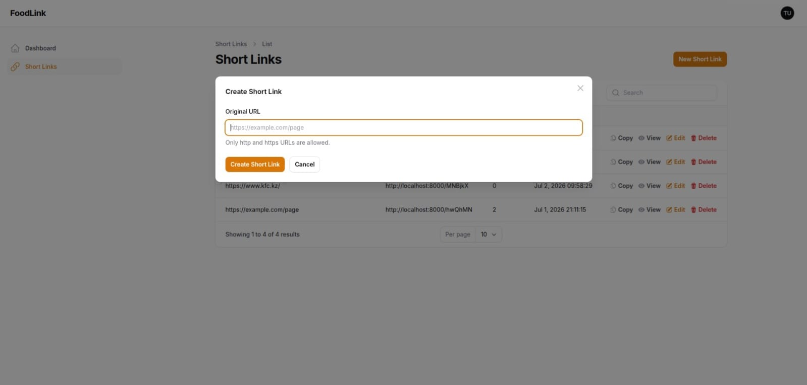

# 🔗 FoodLink


*FoodLink* — сервис коротких ссылок на *Laravel 12* с личным кабинетом на базе *Filament v3*.

Проект позволяет зарегистрированным пользователям создавать короткие ссылки, управлять ими через личный кабинет, отслеживать переходы и просматривать статистику по каждой ссылке.

В проекте реализованы авторизация, генерация коротких ссылок, публичный редирект, история кликов, защита доступа по пользователям, тесты, Docker-окружение, статический анализ и code style checks.

> Проект реализован как тестовое задание с акцентом на *чистую архитектуру, **безопасность доступа, **проверяемость бизнес-логики* и *качество кода*.

---

## 📋 Содержание

- [Описание проекта](#-описание-проекта)
- [Основные возможности](#-основные-возможности)
- [Стек технологий](#-стек-технологий)
- [Архитектура](#-архитектура)
- [Структура проекта](#-структура-проекта)
- [Модель данных](#-модель-данных)
- [Маршруты приложения](#-маршруты-приложения)
- [Личный кабинет](#-личный-кабинет)
- [Создание короткой ссылки](#-создание-короткой-ссылки)
- [Редирект по короткой ссылке](#-редирект-по-короткой-ссылке)
- [История кликов](#-история-кликов)
- [Валидация](#-валидация)
- [Контроль доступа](#-контроль-доступа)
- [Надёжность и защита](#-надёжность-и-защита)
- [Тесты](#-тесты)
- [Статический анализ и стиль кода](#-статический-анализ-и-стиль-кода)
- [Docker-окружение](#-docker-окружение)
- [Локальный запуск](#-локальный-запуск)
- [Полезные команды](#-полезные-команды)
- [Что было дополнительно усилено](#-что-было-дополнительно-усилено)
- [Возможные улучшения](#-возможные-улучшения)
- [Финальный статус проекта](#-финальный-статус-проекта)

---

## 📖 Описание проекта

**FoodLink** позволяет зарегистрированному пользователю создавать короткие ссылки для любых валидных `http` / `https` URL.

Пользователь работает через личный кабинет:

```
/cabinet
```

В кабинете можно:

- создать короткую ссылку через модальное окно;
- увидеть список своих ссылок;
- скопировать короткую ссылку;
- открыть короткую ссылку;
- посмотреть количество переходов;
- открыть детальную страницу ссылки;
- посмотреть историю кликов;
- удалить ссылку.

Публичная короткая ссылка выглядит так:

```
http://localhost:8000/abc123
```

При переходе по такой ссылке приложение:

1. ищет запись по `short_code`;
2. если запись существует и не удалена — фиксирует клик;
3. увеличивает счётчик переходов;
4. сохраняет IP, User-Agent, Referer;
5. делает **302 Redirect** на исходный URL.

---

## ✨ Основные возможности

### Пользовательские возможности

- регистрация пользователя;
- вход в личный кабинет;
- создание короткой ссылки;
- отображение и копирование короткой ссылки;
- редактирование исходного URL;
- удаление ссылки;
- просмотр количества переходов;
- просмотр истории кликов.

### Технические возможности

- генерация уникального короткого кода;
- **обработка collision** при генерации `short_code`;
- уникальность `short_code` на уровне базы данных;
- **soft delete** для коротких ссылок;
- удалённые ссылки не редиректят;
- редирект через отдельный публичный route;
- публичный redirect route не запускает лишнюю session/csrf middleware;
- клики сохраняются в отдельной таблице;
- счётчик кликов увеличивается **атомарно**;
- валидация URL через общий `FormRequest`;
- дополнительная защита в сервисном слое;
- ограничение доступа пользователей только к своим ссылкам;
- **Policy-защита** операций просмотра, редактирования и удаления;
- тестовая база данных отдельно от рабочей;
- покрытие core-сценариев feature-тестами;
- **PHPStan/Larastan level 6**;
- Laravel Pint;
- Composer audit.

---
## 🖼️ Скриншоты

### Регистрация

Пользователь может зарегистрироваться в личном кабинете на базе Filament.



---

### Вход в личный кабинет

Авторизация пользователя через страницу входа Filament.



---

### Dashboard

После входа пользователь попадает в личный кабинет FoodLink.



---

### Список коротких ссылок и история кликов

Пользователь видит только свои ссылки, может скопировать короткий URL, открыть детали и посмотреть историю переходов.



---

### Создание короткой ссылки

Создание ссылки происходит через модальное окно без перехода на отдельную страницу.



## 🛠 Стек технологий

| Технология | Назначение |
|---|---|
| **PHP 8.2** | Runtime |
| **Laravel 12** | Backend framework |
| **Filament v3** | Личный кабинет пользователя |
| **Livewire** | UI-интерактивность Filament |
| **MySQL 8** | Основная база данных |
| **Docker** | Локальное окружение |
| **Docker Compose** | Запуск приложения и БД |
| **PHPUnit** | Автоматические тесты |
| **Laravel Pint** | Code style |
| **Larastan / PHPStan** | Статический анализ |
| **Composer Audit** | Проверка зависимостей на уязвимости |

---

## 🏗 Архитектура

Проект разделён на несколько слоёв:

```
Routes
  ↓
Controller
  ↓
Services
  ↓
Models / Database
```

**Основная бизнес-логика вынесена в сервисы**, чтобы контроллеры и Filament-страницы оставались тонкими.

### Сервисы

| Сервис | Ответственность |
|---|---|
| `ShortCodeGenerator` | Генерация короткого кода |
| `ShortLinkService` | Создание короткой ссылки для пользователя |
| `RedirectService` | Процесс редиректа по короткому коду |
| `ClickTrackingService` | Фиксация клика в транзакции |

#### `ShortCodeGenerator`
```php
public function generate(int $length = 6): string
```

#### `ShortLinkService`
Внутри сервиса:
- trim исходного URL;
- доменная проверка URL;
- генерация `short_code`;
- **retry при collision**;
- создание записи `short_links`;
- начальное значение `clicks_count = 0`.

#### `RedirectService`
- найти короткую ссылку по `short_code`;
- если не найдена — вернуть `404`;
- передать ссылку в click tracking;
- вернуть redirect response на исходный URL.

#### `ClickTrackingService`
Внутри **транзакции**:
- увеличивается `clicks_count`;
- создаётся запись в `link_clicks`.

---

## 📁 Структура проекта

```
.
├── app
│   ├── Filament
│   │   └── Resources
│   │       ├── ShortLinkResource
│   │       │   ├── Pages
│   │       │   │   ├── EditShortLink.php
│   │       │   │   ├── ListShortLinks.php
│   │       │   │   └── ViewShortLink.php
│   │       │   └── RelationManagers
│   │       │       └── ClicksRelationManager.php
│   │       └── ShortLinkResource.php
│   ├── Http
│   │   ├── Controllers
│   │   │   ├── Controller.php
│   │   │   └── RedirectController.php
│   │   └── Requests
│   │       └── StoreShortLinkRequest.php
│   ├── Models
│   │   ├── LinkClick.php
│   │   ├── ShortLink.php
│   │   └── User.php
│   ├── Policies
│   │   └── ShortLinkPolicy.php
│   ├── Providers
│   │   ├── AppServiceProvider.php
│   │   └── Filament
│   │       └── CabinetPanelProvider.php
│   └── Services
│       ├── ClickTrackingService.php
│       ├── RedirectService.php
│       ├── ShortCodeGenerator.php
│       └── ShortLinkService.php
├── database
│   ├── factories
│   ├── migrations
│   └── seeders
├── routes
│   └── web.php
├── tests
│   ├── Feature
│   │   ├── RedirectShortLinkTest.php
│   │   ├── ShortLinkAccessTest.php
│   │   └── ShortLinkServiceTest.php
│   └── TestCase.php
├── Dockerfile
├── docker-compose.yml
├── phpstan.neon
├── phpunit.xml
└── README.md
```

---

## 🗄 Модель данных

### `users`

Стандартная таблица Laravel. Пользователь может иметь много коротких ссылок: `$user->shortLinks()`

---

### `short_links`

| Поле | Назначение |
|---|---|
| `id` | ID ссылки |
| `user_id` | Владелец ссылки |
| `original_url` | Исходный URL |
| `short_code` | Уникальный короткий код |
| `clicks_count` | Количество переходов |
| `created_at` | Дата создания |
| `updated_at` | Дата обновления |
| `deleted_at` | Soft delete |

**Особенности:**
- `short_code` уникален;
- ссылка принадлежит конкретному пользователю;
- используется **soft delete**;
- soft-deleted ссылки не участвуют в редиректе.

---

### `link_clicks`

| Поле | Назначение |
|---|---|
| `id` | ID клика |
| `short_link_id` | Ссылка, по которой был переход |
| `ip_address` | IP адрес посетителя |
| `user_agent` | User-Agent посетителя |
| `referer` | Referer |
| `created_at` | Дата клика |

**Связь:** `ShortLink` has many `LinkClick`

---

## 🌐 Маршруты приложения

```
GET|HEAD  /                                  → redirect to /cabinet
GET|HEAD  cabinet                            → Filament dashboard
GET|HEAD  cabinet/login                      → Login
GET|HEAD  cabinet/register                   → Register
POST      cabinet/logout                     → Logout
GET|HEAD  cabinet/short-links                → Short links list
GET|HEAD  cabinet/short-links/{record}       → Short link view
GET|HEAD  cabinet/short-links/{record}/edit  → Short link edit
GET|HEAD  {shortCode}                        → Public short link redirect
```

---

## 🖥 Личный кабинет

Личный кабинет реализован на базе **Filament v3**.

Путь: `/cabinet`

> Изначальный `/admin` заменён на `/cabinet` — это не super-admin зона, а **личный кабинет пользователя**.

Особенности:
- включён login и registration;
- бренд панели — **FoodLink**;
- пользователь видит **только свои** короткие ссылки;
- технический `FilamentInfoWidget` убран из панели;
- оставлен пользовательский account widget.

---

## ➕ Создание короткой ссылки

Создание ссылки происходит через **модальное окно** в списке ссылок.

Путь: `/cabinet/short-links`

После создания:
- модальное окно закрывается;
- новая ссылка появляется в таблице;
- можно сразу скопировать short URL;
- можно открыть детальную страницу;
- можно посмотреть историю кликов.

> Такой UX выбран вместо отдельной create-страницы, чтобы пользователь не застревал после создания ссылки.

---

## 🔀 Редирект по короткой ссылке

```
http://localhost:8000/abc123
```

```php
Route::get('/{shortCode}', RedirectController::class)
    ->where('shortCode', '[A-Za-z0-9]{6,16}')
    ->withoutMiddleware([
        VerifyCsrfToken::class,
        StartSession::class,
        ShareErrorsFromSession::class,
    ])
    ->name('short-links.redirect');
```

**Особенности:**
- route ограничен regex-паттерном;
- принимаются только коды длиной **от 6 до 16 символов**;
- публичный redirect route **не запускает лишнюю session/csrf middleware**;
- если код не найден — `404`;
- если ссылка soft-deleted — `404`;
- если ссылка найдена — фиксируется клик и возвращается redirect.

Пример ответа:
```
HTTP/1.1 302 Found
Location: https://example.com/page
```

---

## 📊 История кликов

История доступна на странице просмотра ссылки: `/cabinet/short-links/{record}`

В истории отображается:
- дата клика;
- IP;
- User-Agent;
- Referer.

Реализовано через Filament Relation Manager: `ClicksRelationManager`

---

## ✅ Валидация

Валидация реализована в **несколько слоёв**.

### 1. FormRequest

Правила в `app/Http/Requests/StoreShortLinkRequest.php`:

```php
[
    'required',
    'string',
    'url:http,https',
    'max:2048',
]
```

### 2. Filament Form

Filament форма **переиспользует** правила из `StoreShortLinkRequest` — без дублирования вручную.

### 3. Service-level guard

`ShortLinkService` дополнительно проверяет URL перед созданием записи. Это защищает бизнес-логику при вызове сервиса не из Filament, а из:
- консольной команды;
- будущего API;
- job или теста.

Пример недопустимого значения:
```
javascript:alert(1)  ❌
```

---

## 🔒 Контроль доступа

### 1. Query-level isolation

В `ShortLinkResource::getEloquentQuery()` пользователь видит **только свои ссылки**:

```php
where('user_id', $user->id)
```

### 2. Policy

`ShortLinkPolicy` запрещает пользователю:
- просматривать чужую ссылку;
- редактировать чужую ссылку;
- удалять чужую ссылку;
- восстанавливать чужую ссылку;
- force delete чужой ссылки.

Принцип: `$user->id === $shortLink->user_id`

---

## 🛡 Надёжность и защита

| Механизм | Описание |
|---|---|
| **Уникальный `short_code`** | Уникален на уровне БД — дубликаты невозможны |
| **Retry при collision** | До **5 попыток** при `UniqueConstraintViolationException` |
| **Soft delete** | Данные сохраняются в БД, ссылка исключается из редиректа |
| **404 для удалённых** | Soft-deleted ссылки → `404` |
| **Транзакция при клике** | `clicks_count` и запись `link_clicks` в одной транзакции |
| **Ограничение заголовков** | `user_agent` и `referer` обрезаются по длине перед сохранением |
| **Redirect без session** | Публичный route не создаёт лишние Laravel session cookies |
| **Regex constraint** | Route принимает только `[A-Za-z0-9]{6,16}` |

---

## 🧪 Тесты

```
tests/
├── Feature/
│   ├── ShortLinkServiceTest.php
│   ├── RedirectShortLinkTest.php
│   └── ShortLinkAccessTest.php
└── TestCase.php
```

### `ShortLinkServiceTest`

- создание короткой ссылки для пользователя;
- сохранение `original_url` и `short_code`;
- начальное значение `clicks_count = 0`;
- retry при collision `short_code`;
- отклонение невалидных схем (`javascript:alert(1)`).

### `RedirectShortLinkTest`

- редирект на исходный URL;
- увеличение `clicks_count`;
- создание записи в `link_clicks`;
- сохранение User-Agent и Referer;
- `404` для неизвестного `short_code`;
- `404` для soft-deleted ссылки;
- отсутствие записи клика для удалённой ссылки.

### `ShortLinkAccessTest`

- пользователь видит только свои ссылки в Filament Resource query;
- пользователь не видит ссылки другого пользователя;
- Policy запрещает `view/update/delete` для чужой ссылки.

### Результат

```
PASS  Tests\Feature\RedirectShortLinkTest
✓ it redirects to original url and tracks click
✓ unknown short code returns not found
✓ deleted short link returns not found

PASS  Tests\Feature\ShortLinkAccessTest
✓ user can only query own short links in filament resource
✓ policy blocks access to other users short link

PASS  Tests\Feature\ShortLinkServiceTest
✓ it creates short link for user
✓ it retries when generated short code already exists
✓ it rejects non http urls

Tests:      8 passed
Assertions: 20
```

---

## 🔍 Статический анализ и стиль кода

### Laravel Pint

```bash
./vendor/bin/pint --test
```
```
✅ PASS
```

### PHPStan / Larastan

Конфигурация (`phpstan.neon`):

```neon
includes:
    - vendor/larastan/larastan/extension.neon

parameters:
    level: 6
    paths:
        - app
    tmpDir: storage/phpstan
```

```bash
./vendor/bin/phpstan analyse --memory-limit=512M
```
```
✅ [OK] No errors
```

### Composer Audit

```bash
composer audit
```
```
✅ No security vulnerability advisories found.
```

---

## 🐳 Docker-окружение

Проект запускается через **Docker Compose**.

### Сервисы

**`app`** — PHP-контейнер:
- PHP 8.2 CLI + Composer 2;
- Laravel `artisan serve`;
- необходимые PHP extensions.
- Порт: `8000:8000`

**`mysql`** — MySQL 8:
- Порт: `3309:3306`

```env
MYSQL_DATABASE=food_link
MYSQL_USER=food_link_user
MYSQL_PASSWORD=secret
MYSQL_ROOT_PASSWORD=root
```

---

## 🚀 Локальный запуск

### 1. Клонировать репозиторий

```bash
git clone <repository-url>
cd food-link
```

### 2. Создать `.env`

```bash
cp .env.example .env
```

### 3. Собрать и запустить контейнеры

```bash
docker compose build
docker compose up -d
```

### 4. Установить зависимости и настроить приложение

```bash
docker compose exec app composer install
docker compose exec app php artisan key:generate
docker compose exec app php artisan migrate
```

### 5. Открыть приложение

```
http://localhost:8000
```

Корневой URL перенаправит в личный кабинет:

```
http://localhost:8000/cabinet
```

### 6. Зарегистрировать пользователя

```
http://localhost:8000/cabinet/register
```

---

### Пример `.env`

```env
APP_NAME=FoodLink
APP_ENV=local
APP_DEBUG=true
APP_URL=http://localhost:8000

DB_CONNECTION=mysql
DB_HOST=mysql
DB_PORT=3306
DB_DATABASE=food_link
DB_USERNAME=food_link_user
DB_PASSWORD=secret

SESSION_DRIVER=database
CACHE_STORE=database
QUEUE_CONNECTION=database
```

---

### Подключение к БД через DBeaver

| | Хост-машина | Внутри Docker |
|---|---|---|
| **Host** | `localhost` | `mysql` |
| **Port** | `3309` | `3306` |
| **Database** | `food_link` | `food_link` |
| **Username** | `food_link_user` | `food_link_user` |
| **Password** | `secret` | `secret` |

---

### Настройка тестовой базы данных

Тесты используют **отдельную БД** `food_link_testing`, чтобы не трогать рабочую.

```bash
docker compose exec mysql mysql -uroot -proot -e \
  "CREATE DATABASE IF NOT EXISTS food_link_testing CHARACTER SET utf8mb4 COLLATE utf8mb4_unicode_ci;"
```

Настройки в `phpunit.xml`:

```xml
<env name="DB_DATABASE" value="food_link_testing"/>
<env name="DB_USERNAME" value="root"/>
<env name="DB_PASSWORD" value="root"/>
```

---

## 🧰 Полезные команды

```bash
# Запуск тестов
docker compose exec app php artisan test

# Проверка стиля кода
docker compose exec app ./vendor/bin/pint --test

# Статический анализ
docker compose exec app ./vendor/bin/phpstan analyse --memory-limit=512M

# Проверка зависимостей
docker compose exec app composer audit
docker compose exec app composer validate

# Миграции
docker compose exec app php artisan migrate

# Список маршрутов
docker compose exec app php artisan route:list

# Очистка кешей
docker compose exec app php artisan optimize:clear

# Управление контейнерами
docker compose up -d
docker compose down
docker compose build
```

---

## 💡 Что было дополнительно усилено

| # | Улучшение | Детали |
|---|---|---|
| 1 | **Личный кабинет** вместо `/admin` | Filament настроен на `/cabinet` — соответствует назначению |
| 2 | **Modal create UX** | Создание ссылки через модальное окно — пользователь сразу видит результат |
| 3 | **Централизованная валидация** | Filament форма переиспользует `StoreShortLinkRequest` |
| 4 | **Domain-level validation** | Сервис защищает бизнес-логику от обхода UI-валидации |
| 5 | **Retry при collision** | До 5 попыток при конфликте `short_code` |
| 6 | **Click tracking в транзакции** | Счётчик и запись фиксируются атомарно |
| 7 | **Redirect без session cookies** | Публичный route не создаёт лишние cookie |
| 8 | **Отдельная тестовая БД** | Тесты изолированы от рабочей базы |
| 9 | **PHPStan level 6** | Статический анализ выше базового уровня |
| 10 | **Чистый `composer.json`** | Проектное имя и описание вместо skeleton-значений |

---

## 🔮 Возможные улучшения

- **Кастомный dashboard** — виджеты: total links, total clicks, most clicked, clicks chart по дням
- **Expiration date** — поле `expires_at` + логика `expired link → 404`
- **Custom alias** — возможность задавать `http://localhost:8000/my-link`
- **Rate limiting** — throttle для публичных редиректов
- **REST API** — `POST/GET/DELETE /api/short-links`
- **Экспорт статистики** — CSV с историей кликов
- **Геоаналитика** — country, city, device, browser в `link_clicks`
- **Очереди** — вынести click tracking в queue для высоких нагрузок
- **Docker healthcheck** — для MySQL и app-контейнера
- **Production web server** — Nginx + PHP-FPM вместо `artisan serve`

---

## 🏁 Финальный статус проекта

| Статус | Функциональность |
|---|---|
| ✅ | Laravel 12 + PHP 8.2 + MySQL 8 |
| ✅ | Docker / Docker Compose |
| ✅ | Filament v3 — личный кабинет на `/cabinet` |
| ✅ | Регистрация и авторизация |
| ✅ | Создание коротких ссылок (Modal UX) |
| ✅ | Генерация `short_code` + retry при collision |
| ✅ | Публичный redirect route |
| ✅ | Click tracking + счётчик переходов |
| ✅ | История кликов в кабинете |
| ✅ | Изоляция ссылок по пользователю |
| ✅ | Policy access control |
| ✅ | FormRequest + domain-level валидация |
| ✅ | Soft delete + 404 для удалённых ссылок |
| ✅ | Redirect без лишних session cookies |
| ✅ | Feature тесты + отдельная тестовая БД |
| ✅ | Laravel Pint |
| ✅ | PHPStan / Larastan level 6 |
| ✅ | Composer audit |

### Финальные проверки

```bash
php artisan test
# → 8 passed / 20 assertions ✅

./vendor/bin/pint --test
# → PASS ✅

./vendor/bin/phpstan analyse --memory-limit=512M
# → OK, no errors ✅

composer validate
# → valid ✅

composer audit
# → no security vulnerability advisories found ✅
```

---

## 📄 License

This project was created as a Laravel test assignment.
